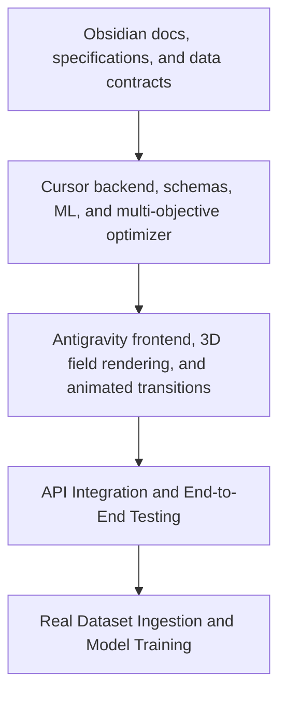

# FieldIQ Next-Gen Project Vision & Master Plan

## 1. Core Objective

Build a professional-grade cricket tactical intelligence platform capable of dynamically recommending optimal field configurations.

The system answers:
> **"Given everything happening right now, where should all 9 fielders be positioned to maximize the probability of the desired outcome?"**

Unlike the previous prototype which relied heavily on fixed hardcoded rules and a simple greedy run-saving optimizer, the next-generation FieldIQ architecture shifts toward a **data-driven, context-aware, and simulation-backed optimization engine**.

---

## 2. Dynamic vs Rule-Based Architecture

### Old Prototype Pipeline
1. Input: Batter Profile, Bowler Profile, Match Phase.
2. Select positions from a static lookup table based on simple rule thresholds (e.g. edge risk, sweep risk).
3. Assign remaining fielders via a greedy optimizer covering zones.
4. Output a single static field configuration.

### Next-Gen Optimization Pipeline
1. **Real Match Data Ingestion**: Clean delivery-level data mapping and schema verification.
2. **Contextual Feature Engine**: Extracts multi-dimensional attributes for batters, bowlers, and fielders.
3. **Outcome Probability Estimators**: Calculates the probability of distinct ball outcomes:
   - $P(\text{Wicket} \mid \text{Batter}, \text{Bowler}, \text{Delivery}, \text{Field})$
   - $P(\text{Dot} \mid \text{Batter}, \text{Bowler}, \text{Delivery}, \text{Field})$
   - $P(\text{Boundary} \mid \text{Batter}, \text{Bowler}, \text{Delivery}, \text{Field})$
4. **Field Candidate Generator**: Evaluates multiple legal candidate configurations.
5. **Multi-Objective Optimizer**: Computes expected field values and runs saved based on situational strategic objectives (e.g. protecting a lead vs needing a wicket immediately).
6. **Monte Carlo Simulation Engine**: Simulates outcomes to rank field configurations under uncertainty.
7. **Human-in-the-Loop 3D Dashboard**: Presents three strategic recommendations (Aggressive, Balanced, Run-Prevention) with animated transitions, confidence metrics, and manual overrides with instant recalculation.

---

## 3. Recommended Build Order

To prevent building a beautiful interface on top of a hardcoded prototype, development will follow this strict order:

---

## 4. Key Implementation Principles
- **Baselines First:** Build deterministic baselines before introducing machine learning models so every model can be validated against a transparent reference.
- **Rule Separation:** Keep ICC rules and field legality checks isolated from tactical engines.
- **Data Integrity:** Treat missing data explicitly. Never fabricate, guess, or infer missing cricket events.
- **Explainability:** Provide clear explanation logs for why each fielder is placed at a specific coordinate and why alternative configurations were rejected.
